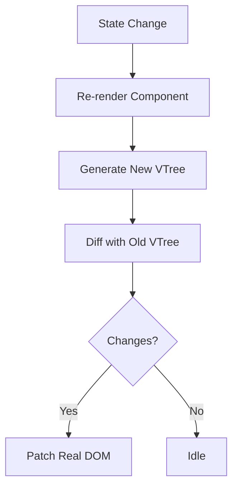
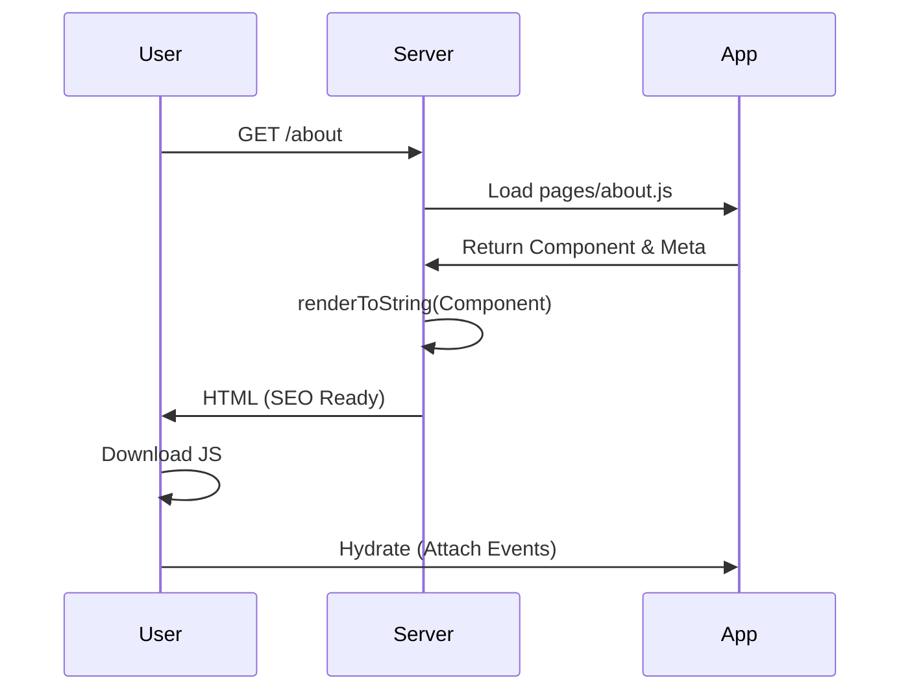

# ZhinStack v2 Architecture

## 1. Vision & Overview
ZhinStack v2 is a modern, enterprise-grade web framework designed to be "React + Svelte + Next.js, but cleaner". It moves away from string-based DOM manipulation to a robust **Virtual DOM** with **Fine-grained Reactivity**.

## 2. Core Engine Upgrade

### A. Virtual DOM (VDOM)
Instead of `innerHTML`, we use lightweight VNodes.
*   **Structure**: `{ tag, props, children, key }`
*   **Input**: Tagged Template Literals (`html\``) parsed at runtime (lightweight HTM implementation) or compiled.
*   **Diffing**: Keyed dual-ended diffing algorithm for minimal DOM updates.

### B. Reactive System (Signals)
We adopt a "Push-Pull" reactivity model similar to SolidJS/Vue.
*   **Signals**: `const [count, setCount] = createSignal(0)`
*   **Effects**: `createEffect(() => console.log(count()))`
*   **Components**: Components re-run only when their dependent signals change (if using functional components) or trigger `update()` via Proxy state (if using Class components).

## 3. Server-Side Rendering (SSR) & SEO

### A. The Pipeline
1.  **Request**: Server receives request (e.g., `/`).
2.  **Route Match**: Identifies `src/pages/index.js`.
3.  **Data Fetch**: Runs static `load()` or `getServerSideProps()` equivalent.
4.  **Render**: `renderToString(vnode)` generates HTML.
5.  **Meta Injection**: Extracts `export const meta` and injects into `<head>`.
6.  **Response**: Sends fully formed HTML.
7.  **Hydration**: Client takes over, attaching event listeners to existing DOM.

### B. Diagrams

#### Virtual DOM Flow


#### SSR Pipeline


## 4. File-Based System (Directory Structure)

```text
/
├── api/                  # Serverless API endpoints
├── public/               # Static Assets (favicon, logo, robots.txt)
├── src/
│   ├── components/       # Reusable UI Components
│   ├── layouts/          # Layout wrappers (Header, Footer)
│   ├── pages/            # File-based Routing
│   │   ├── index.js      # /
│   │   ├── about.js      # /about
│   │   └── blog/
│   │       ├── [id].js   # /blog/123 (Dynamic)
│   │       └── index.js  # /blog
│   ├── styles/           # Global CSS
│   └── app.js            # Client Entry (Hydration)
├── zhin-core/            # The Framework Engine
│   ├── vdom.js           # h(), VNode
│   ├── diff.js           # Patch algorithm
│   ├── reactive.js       # Signals & Observers
│   ├── html.js           # Template Parser
│   ├── router.js         # Client-side Router
│   ├── ssr.js            # Server Renderer
│   └── component.js      # Base Class
├── server.js             # Dev Server + SSR Handler
└── package.json
```

## 5. Coding Standards
*   **Zero-Build**: Everything works in standard Node.js/Browser without Webpack/Vite (though optional optimization is possible).
*   **Types**: JSDoc for type safety.
