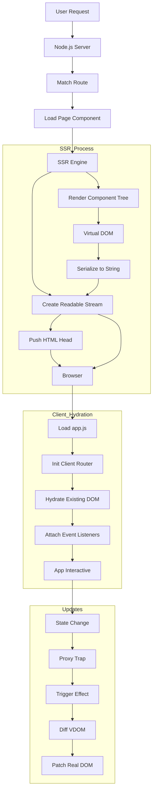

# ZhinStack Next (v2) Architecture

ZhinStack v2 is a modern, enterprise-grade web framework designed to be fast, simple, and standard-compliant. It avoids complex build tools in development by leveraging native ES Modules and modern browser capabilities.

## 1. Core Architecture

### Virtual DOM & Reactivity
- **VDOM**: A lightweight Virtual DOM implementation (`zhin-core/vdom.js`) that uses `html` tagged templates. In the browser, it uses the native `<template>` element for parsing. On the server, it performs efficient string interpolation.
- **Diffing**: A Keyed Diffing algorithm (`zhin-core/diff.js`) ensures minimal DOM mutations. It supports efficient list reordering and attribute patching.
- **Reactivity**: A Proxy-based system (`zhin-core/reactive.js`) similar to Vue 3. State changes automatically trigger Component updates via an effect runner.

### Server-Side Rendering (SSR) & Streaming
- **SSR**: The framework renders the initial HTML on the server for optimal SEO and Time-to-Content.
- **Streaming**: Responses are streamed (`zhin-core/ssr.js`), sending the `<head>` immediately to allow early asset loading (TTFB optimization).
- **Hydration**: Client-side logic attaches event listeners to the server-rendered DOM instead of destroying and recreating it.

### File-Based Routing
- **Convention**: Routes are defined by the file structure in `src/pages`.
    - `index.js` -> `/`
    - `about.js` -> `/about`
    - `[id].js` -> `/:id` (Dynamic Routes)
- **Zero-Config**: The server scans these files and generates a routing map automatically.
- **Injection**: The routing map is injected into the client-side HTML, allowing the Client Router to take over navigation seamlessly.

## 2. Flow Diagram (VDOM & SSR)



## 3. Final Folder Structure

```
zhinstack/
├── api/                  # Vercel / Serverless Entry Points
│   └── index.js          # Main Handler
├── public/               # Static Assets
│   ├── logo-icon.svg
│   └── logo-full.svg
├── src/
│   ├── pages/            # File-Based Routes
│   │   ├── index.js
│   │   ├── about.js
│   │   └── [id].js
│   └── app.js            # Client Entry Point
├── zhin-core/            # Framework Core
│   ├── Component.js      # Base Component Class
│   ├── Router.js         # Client-Side Router
│   ├── vdom.js           # VDOM Factory & Parser
│   ├── diff.js           # Diffing & Hydration
│   ├── reactive.js       # Reactivity System
│   ├── ssr.js            # Server-Side Rendering
│   ├── handler.js        # Request Handler (Server logic)
│   └── Lazy.js           # Lazy Loading Wrapper
├── verification/         # Test Scripts
├── server.js             # Local Dev Server
├── vercel.json           # Deployment Config
└── package.json
```

## 4. Roadmap (v2 → v3)

- [ ] **Edge Middleware**: Support for running logic on Edge (Cloudflare/Vercel Edge) for auth/redirects.
- [ ] **Data Fetching**: Implementing `getServerSideProps` or `loader` pattern data pre-fetching.
- [ ] **Bundler Integration**: Optional integration with Vite/Rollup for production optimization (minification, tree-shaking).
- [ ] **CSS-in-JS**: Built-in scoped styling solution.
- [ ] **Form Actions**: Server Actions support for easy form handling.
